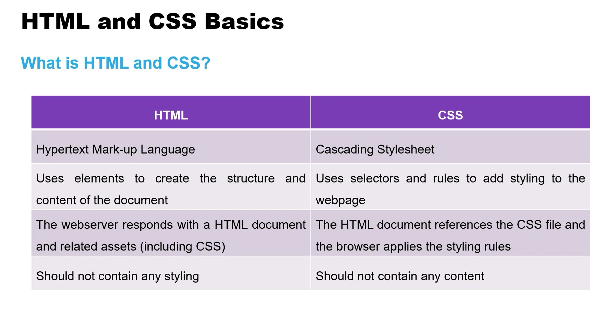

# 6.1-Webapps

#### User Experience (UX)
- User Experience (UX) relates to a person’s emotions and feelings when using a particular product or service, such as a website or application.

#### User Experience Design (UXD)
- User Experience Design (UXD) is the process of improving a person’s experience of using a particular product or service.
- Key facets include:
	- Usability
	- Accessibility
	- Desirability
	- Credibility
	- Usefulness
	- Value

#### What is a Wireframe?
- A wireframe is a mock-up of a web page’s structure
- It includes elements to demonstrate format and functionality
- Elements are organised to achieve a particular purpose or goal  

